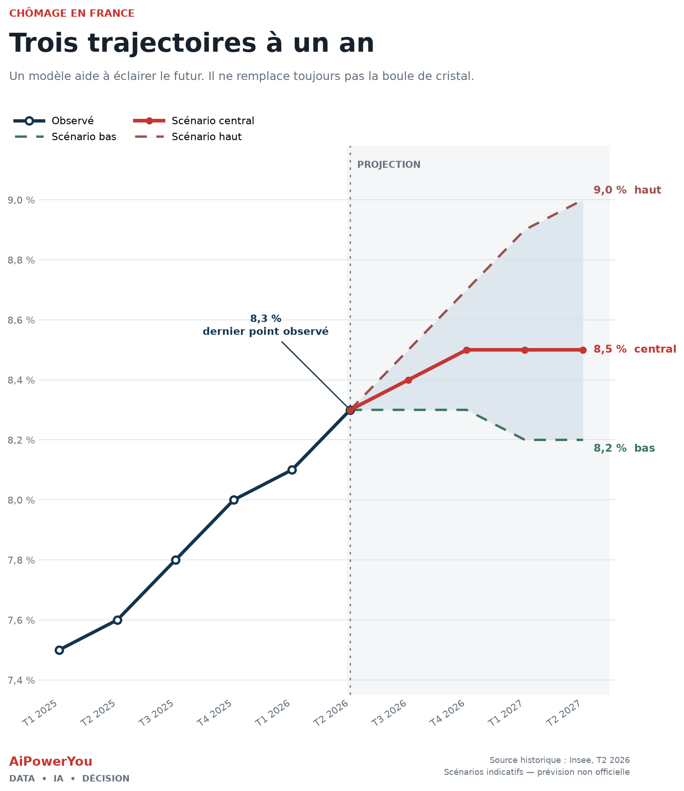

# Prévoir le chômage français avec l'open data

Un pipeline reproductible qui collecte les séries officielles de l'Insee et d'Eurostat, construit un jeu trimestriel sans fuite temporelle, puis alimente un Transformer multivarié à horizon quatre trimestres.

Le dépôt conserve une séparation nette entre :

1. les observations issues des API publiques ;
2. la trajectoire statistique brute du modèle ;
3. les scénarios économiques publiés — bas, central et haut.



## Démarrage rapide

Python 3.11 ou 3.12 est requis. Python 3.11 est recommandé sous Windows.

### Windows PowerShell

Le script Windows crée un environnement `.venv` isolé et utilise toujours son
propre exécutable Python. Cela évite les conflits avec les paquets installés
globalement par Microsoft Store Python.

```powershell
.\scripts\bootstrap_windows.ps1 -Recreate
.\scripts\tasks.ps1 data
.\scripts\tasks.ps1 forecast
.\scripts\tasks.ps1 plot
```

`-Recreate` supprime uniquement l'ancien dossier `.venv` du projet. Il est
recommandé après une incompatibilité binaire NumPy, pandas ou numexpr.

### Linux et macOS

```bash
python -m venv .venv
source .venv/bin/activate
python -m pip install -e ".[dev]"

python fetch_open_data.py
python train_transformer.py --epochs 1200 --seeds 5
python plot_scenarios.py
```

Équivalents courts sous Linux/macOS : `make install`, `make data`,
`make forecast`, `make plot`. Windows utilise `scripts/tasks.ps1` et n'a pas
besoin de la commande `make`.

La collecte ne nécessite pas de clé d'API. Elle applique un timeout, un nombre
limité de tentatives et un backoff exponentiel en cas de réponse `429` ou
d'erreur serveur. Le certificat HTTPS est vérifié avec le bundle CA de
`certifi`.

Dans une entreprise qui inspecte les flux HTTPS, indiquez le bundle PEM fourni
par l'équipe IT avant la collecte :

```powershell
$env:SSL_CERT_FILE = "C:\certificats\chaine-entreprise.pem"
.\scripts\tasks.ps1 data
```

La vérification TLS ne doit pas être désactivée.

## Données collectées

| Signal | Source | Série / dataset | Utilité économique |
|---|---|---|---|
| Taux de chômage BIT | Insee BDM | `001688527` | Variable cible trimestrielle |
| Climat des affaires | Insee BDM | `001565530` | Signal avancé sur l'activité et les embauches |
| IPC, base 2015 | Insee BDM | `001759970` | Historique long de l'inflation |
| IPC, base 2025 | Insee BDM | `011814630` | Prolongement récent de l'indice des prix |
| PIB réel, variation trimestrielle | Eurostat | `namq_10_gdp` | Cycle d'activité, proche de la logique de la loi d'Okun |
| Emploi, variation trimestrielle | Eurostat | `namq_10_a10_e` | Transmission directe entre activité, emploi et chômage |
| Taux d'emplois vacants | Eurostat | `jvs_q_nace2` | Indicateur optionnel de tension du marché du travail |

Le script `fetch_open_data.py` :

- télécharge les réponses officielles ;
- normalise les périodes SDMX et JSON-stat ;
- raccorde les deux bases de l'IPC par leur ratio médian sur la période commune ;
- agrège les séries mensuelles seulement lorsque les trois mois du trimestre sont disponibles ;
- calcule l'inflation en glissement annuel ;
- joint les variables cœur sur leurs trimestres communs ;
- écrit les données brutes dans `data/raw/`, le jeu modèle dans `data/model_features.csv` et sa traçabilité dans `data/model_features.metadata.json`.

Avec les données disponibles au 7 août 2026, le pipeline produit 102 trimestres complets, de 2001-T1 à 2026-T2. Ce nombre évoluera avec les publications et révisions officielles.

Options utiles :

```bash
python fetch_open_data.py --start 2010-Q1
python fetch_open_data.py --skip-vacancies
python fetch_open_data.py --output data/mon_dataset.csv
```

## Modèle

Le Transformer encode une fenêtre glissante de 12 trimestres avec cinq variables cœur : chômage, PIB, emploi, inflation et climat des affaires. Sa tête prédit directement les mouvements cumulés du chômage aux quatre horizons suivants.

Plusieurs initialisations sont agrégées afin de mesurer et réduire la sensibilité au hasard d'entraînement. Le fichier `data/transformer_raw_forecast.csv` contient la moyenne de l'ensemble et l'écart-type entre initialisations.

Point méthodologique important : le modèle n'utilise pas de valeurs futures supposées pour les variables exogènes. Il apprend à partir de l'information disponible dans la fenêtre historique. Pour une évaluation sérieuse, une validation chronologique en fenêtre glissante reste préférable à un découpage aléatoire.

La sortie statistique n'est pas présentée comme une certitude. `data/scenarios.csv` conserve les hypothèses économiques explicites : **le modèle calcule ; l'analyste assume les scénarios**.

## Qualité du code et tests

Le projet suit une politique de qualité exécutable localement et dans GitHub Actions :

- **Ruff** contrôle les règles PEP 8, les imports, les erreurs probables et le formatage ;
- **mypy** vérifie les annotations de types du package et des scripts ;
- **pytest** teste les clients API, les transformations et la préparation temporelle du modèle ;
- **pytest-cov** impose une couverture minimale de 80 % sur le package ;
- **pre-commit** permet d'appliquer les contrôles avant chaque commit.

Tous les contrôles :

```bash
make check
```

Sous Windows :

```powershell
.\scripts\tasks.ps1 check
```

Correction automatique du formatage et des problèmes simples :

```bash
make format
pre-commit install  # optionnel : active les contrôles avant chaque commit
```

Sous Windows :

```powershell
.\scripts\tasks.ps1 format
```

Les tests unitaires sont hors ligne. Ils utilisent des réponses Insee SDMX et Eurostat JSON-stat contrôlées, puis vérifient notamment :

- le parsing et la construction des appels API ;
- le raccordement des bases de l'IPC ;
- l'exclusion des trimestres incomplets ;
- les jointures des variables économiques ;
- la forme des fenêtres temporelles et des cibles à quatre horizons ;
- les dimensions d'entrée et de sortie du réseau PyTorch ;
- le passage d'une année à la suivante dans les périodes prédites.

```bash
pytest -m "not integration"
```

Deux tests d'intégration interrogent réellement les API publiques :

```bash
RUN_INTEGRATION=1 pytest -m integration
```

Le workflow `.github/workflows/ci.yml` exécute à chaque push et pull request :

1. Ruff et mypy ;
2. les tests unitaires sous Python 3.11 et 3.12 ;
3. la mesure de couverture avec conservation du rapport XML ;
4. un contrôle Windows utilisant les scripts PowerShell du dépôt.

Les tests réels Insee et Eurostat sont exécutés chaque semaine et peuvent être lancés manuellement depuis l'onglet **Actions**. Ils restent séparés du contrôle principal pour ne pas bloquer un commit lorsque l'un des fournisseurs est temporairement indisponible.

## Structure

```text
.
├── .github/workflows/ci.yml
├── .pre-commit-config.yaml
├── assets/chomage_france_scenarios.png
├── data/
│   ├── scenarios.csv
│   └── unemployment_history.csv
├── scripts/
│   ├── bootstrap_windows.ps1
│   └── tasks.ps1
├── src/aipoweryou_forecast/
│   ├── features.py
│   ├── modeling.py
│   └── open_data.py
├── tests/
│   ├── test_features.py
│   ├── test_integration_apis.py
│   ├── test_modeling.py
│   ├── test_open_data.py
│   └── test_transformer.py
├── fetch_open_data.py
├── train_transformer.py
├── plot_scenarios.py
├── POST_LINKEDIN.md
├── pyproject.toml
└── README.md
```

## Scénarios publiés

| Scénario | T2 2027 | Hypothèses principales |
|---|---:|---|
| Bas | 8,2 % | Stabilisation de l'emploi, léger mieux conjoncturel et atténuation des effets administratifs |
| Central | 8,5 % | Croissance faible, recrutements prudents et absence de choc majeur |
| Haut | 9,0 % | Activité plus dégradée, recul de l'emploi et tensions prolongées |

Ces trajectoires sont des scénarios analytiques, pas des prévisions officielles ni des conseils de politique économique.

## Documentation officielle

- [Catalogue des API de l'Insee](https://www.insee.fr/fr/information/8184146)
- [API BDM de l'Insee](https://portail-api.insee.fr/catalog/api/eebab65a-9aef-4da5-bab6-5a9aefeda552?aq=ALL)
- [API Statistics d'Eurostat](https://ec.europa.eu/eurostat/web/user-guides/data-browser/api-data-access/api-statistics)
- [Publication Insee — chômage au T2 2026](https://www.insee.fr/fr/statistiques/9032359)

## Auteur

**AiPowerYou** — Data, IA et décisions opérationnelles.
